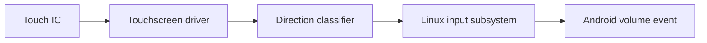

# Android Kernel Internship

OnePlus 7T용 Android 커널을 직접 수정하며 system call, 네트워크 드라이버,
터치 입력이 사용자 공간 동작으로 이어지는 경로를 검증한 5주 인턴십
프로젝트입니다.

> 이 저장소는 완성형 애플리케이션이 아니라 실기기 커널 실험에 사용한
> 소스 아카이브입니다. 빌드와 플래시는 대상 기기와 toolchain에 강하게
> 의존하며 잘못된 이미지는 기기를 부팅 불능 상태로 만들 수 있습니다.

## 프로젝트에서 다룬 문제

- 커널이 실행 파일의 권한과 경로를 판단하는 과정을 사용자 공간의
  `errno` 및 커널 로그와 함께 추적
- RTL8152 USB Ethernet 드라이버를 설치·갱신하고 실제 연결 검증
- 터치 좌표의 진행 방향을 원형 제스처로 분류해 Android 표준 볼륨 키
  이벤트로 전달

## 핵심 구현

### System call 관찰과 제어

`execveat`, `faccessat`, `stat` 계열 호출 경로에 로그를 추가해
`task_struct`의 process name, UID, PID와 실제 filename을 비교했습니다.
Termux에서 명령을 실행하며 `EPERM`과 `ENOENT`가 사용자 공간에서 어떻게
다르게 보이는지도 확인했습니다.

### 터치 제스처를 표준 입력 이벤트로 연결

노이즈가 큰 개별 좌표 대신 gesture 전체에서 tangent 방향이 증가하는
비율을 사용해 시계·반시계 방향을 분류했습니다. 판정 결과는 별도 앱 전용
통신 경로가 아니라 Linux input subsystem의 `KEY_VOLUMEUP`,
`KEY_VOLUMEDOWN` 이벤트로 전달했습니다.

## 검증 환경과 결과

| 항목 | 검증 방식 | 결과 |
|---|---|---|
| 원형 터치 제스처 | 커널 로그와 OnePlus 7T 실기기 입력 | 시계·반시계 방향을 볼륨 키 이벤트로 전달 |
| system call 제한 | Termux 명령과 커널 로그 비교 | 프로세스·UID·경로 조건 및 반환 오류 확인 |
| RTL8152 | 드라이버 설치 후 USB Ethernet 연결 | 실제 네트워크 연결 확인 |

## 저장소 구조

| 경로 | 내용 |
|---|---|
| `drivers/input/oneplus_touchscreen/` | OnePlus 터치 패널 및 gesture 처리 경로 |
| `drivers/net/usb/` | RTL8152를 포함한 USB 네트워크 드라이버 |
| `fs/` | 실행·접근·파일 상태 조회 system call 경로 |
| `arch/arm64/configs/oneplus7-stock_defconfig` | OnePlus 7 계열 ARM64 커널 설정 |
| `build_*.sh` | 당시 사용한 커널 빌드 스크립트 |

## 기술 스택

- Linux / Android Kernel, C
- ARM64, OnePlus 7T
- Linux input subsystem, USB network driver
- Kernel logging, Termux 기반 사용자 공간 검증

## 한계

- gesture 데이터셋이 없어 false positive/negative를 정량화하지 못했습니다.
- 공개 소스에는 upstream 커널 코드가 함께 포함되어 있어, 이 저장소 전체를
  개인 작성 코드로 간주해서는 안 됩니다.
- 최신 Android 또는 다른 기기에서의 호환성을 보장하지 않습니다.

커널 원본 라이선스는 [COPYING](COPYING)을 따릅니다.
